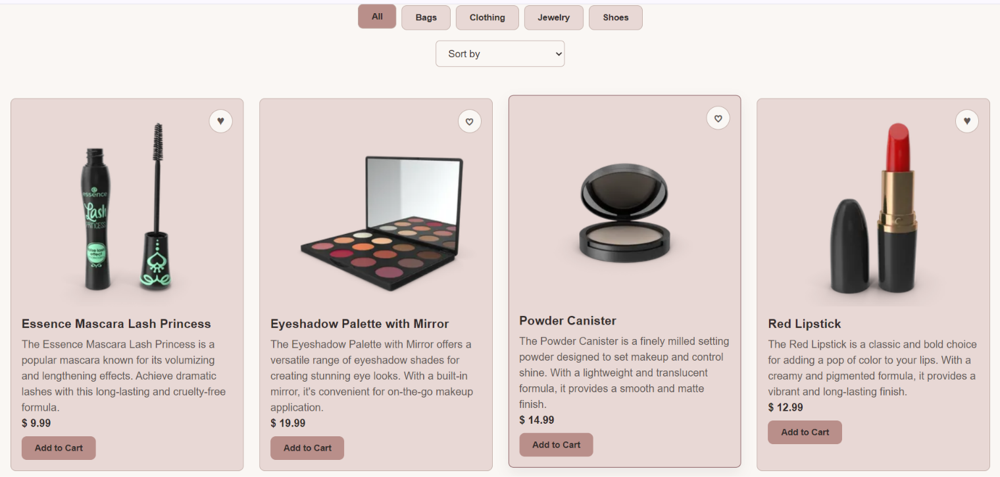
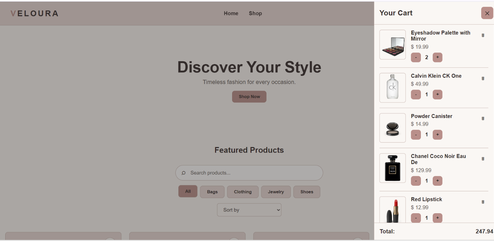

# Veloura

A fashion & accessories e-commerce site built with **vanilla JavaScript** — no frameworks, no libraries. Built as a deliberate exercise in understanding *why* frameworks like React exist, by first solving the problems they solve, by hand.

**Live site:** [veloura-ecommerce.netlify.app](https://veloura-ecommerce.netlify.app)


## About

Veloura started as a 15-milestone learning project: vanilla JS first, React rebuild later. Instead of jumping straight into a framework, the goal was to build every core e-commerce feature — filtering, cart state, routing, async data fetching — from scratch, so that the problems a framework solves are actually *felt* before they're abstracted away.

## Features

- 🛍️ Dynamic product catalog fetched from a live API ([DummyJSON](https://dummyjson.com))
- 🔍 Real-time search, category filtering, and sorting (combinable)
- 📄 Product detail views with hash-based routing (`#/product/:id`), shareable and refresh-safe
- 🛒 Cart with quantity controls, running total, and persistent storage
- 🤍 Wishlist with toggle, dedicated drawer, and persistent storage
- 📱 Fully responsive, mobile-first layout with an accessible hamburger menu
- ⏳ Simulated and real loading/error states for async data fetching
- 💾 Cart and wishlist persist across page reloads via `localStorage`
- ♿ Accessibility-conscious markup (`aria-*` attributes, focus states, semantic headings)

## Tech Stack

- **HTML5** — semantic markup
- **CSS3** — custom properties, Flexbox, Grid, mobile-first media queries
- **JavaScript (ES6+)** — ES Modules, `async/await`, `fetch()`, `localStorage`
- **[DummyJSON API](https://dummyjson.com)** — live product data
- **Netlify** — deployment

No frameworks, no build tools, no dependencies — everything here is hand-written vanilla JS.

## Project Structure

```
veloura/
├── index.html
├── css/
│   └── style.css
├── js/
│   ├── state.js       # centralized app state
│   ├── api.js          # fetches product data from DummyJSON
│   ├── storage.js      # localStorage persistence for cart/wishlist
│   ├── products.js     # product rendering, filtering, sorting
│   ├── cart.js          # cart logic and rendering
│   ├── wishlist.js      # wishlist logic and rendering
│   ├── router.js        # hash-based routing + load orchestration
│   └── main.js           # entry point — wires everything together
└── assets/
```

The codebase started as a single file and was later refactored into ES Modules, with each file owning one responsibility.

## Running Locally

1. Clone the repo:
   ```bash
   git clone https://github.com/maryam-dev26/veloura.git
   cd veloura
   ```
2. Open `index.html` with a local server (e.g. VS Code's **Live Server** extension) — this project uses ES Modules, so it won't run correctly by opening the file directly in a browser (`file://`).

No build step, no `npm install` — just serve the folder.

## Screenshots

| Product Grid | Cart Drawer | Mobile View |
|---|---|---|
|  |  |  |

## What I Learned

This project was less about *building an e-commerce site* and more about understanding, deeply, what problems each piece of JavaScript actually solves.

A few things that stuck:

- **State as the single source of truth.** Every feature — filters, cart, wishlist — follows the same loop: change the data, then re-render everything from it. Never touch the DOM directly. This one idea made cart quantity updates, wishlist toggles, and even the sort/filter/search pipeline all follow the same predictable pattern.
- **Async isn't optional to understand.** Moving from a local array to a real API surfaced timing bugs that don't show up with synchronous code — rendering the cart before the product data had even finished loading, for instance. Debugging that taught me more about `async/await` than any tutorial could.
- **Modules force you to think in boundaries.** Splitting one long file into eight modules meant constantly asking "whose responsibility is this?" — and running into real constraints, like read-only import bindings, that shaped how the final state design turned out.
- **Responsive design is iterative, not one CSS pass.** Getting the hamburger menu right took several rounds of z-index conflicts, layout shifts, and rethinking `position: fixed` vs `absolute` — each one only visible by actually testing at different screen sizes.

Every one of these lessons came from a bug, not from getting something right on the first try.

## What's Next

This vanilla JS build is the first half of a two-part project. The second half: rebuilding Veloura in **React**, using the exact same feature set — this time with the lived understanding of *why* things like state management and component re-rendering are handled the way they are.

## License

Built for learning purposes. Feel free to explore the code.